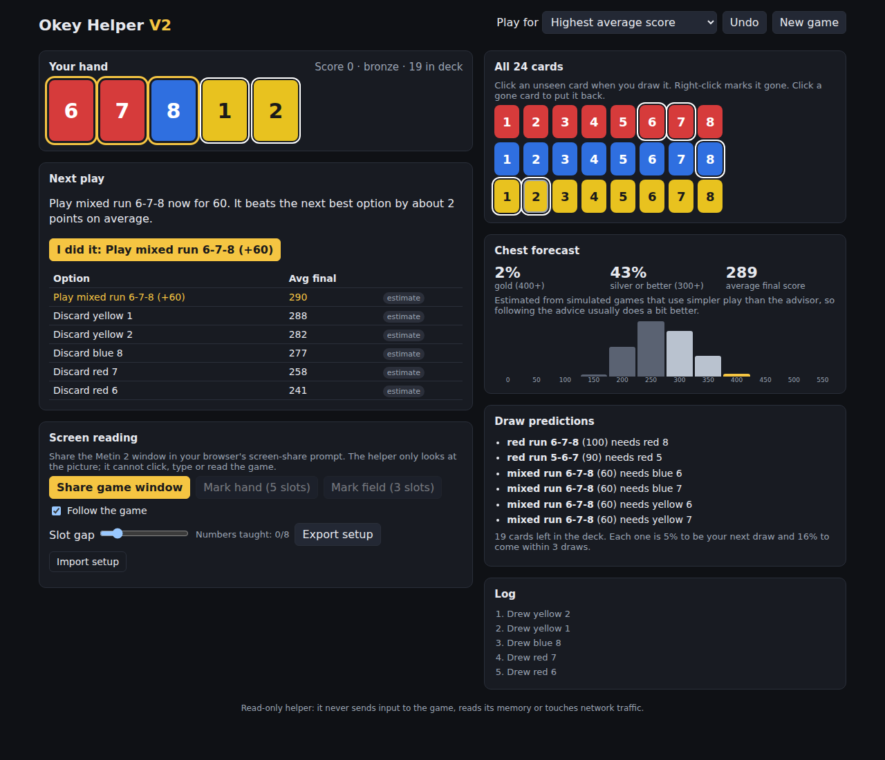

# Okey Game Helper V2

A companion for the Metin 2 Okey card minigame. It suggests your best next play, predicts
draws and chest odds, and can follow the game by reading the game window from the screen.



V1 lives at [Catpsan/Okey-Game-Helper](https://github.com/Catpsan/Okey-Game-Helper).

## Hard rule: read-only

The helper only **looks** at the pixels of the game window you choose to share. It never:

- sends keyboard or mouse input to the game,
- reads or writes game memory,
- reads, modifies or injects network packets.

Every action in the game is made by the player.

## What's new compared with V1

- **Real move optimisation.** Every option is compared: each combo you could play, each discard,
  and holding a combo to wait for a better one (e.g. keeping red 6-7 + blue 8 and waiting for
  red 8's 100-point flush instead of taking 60 now).
  - With 14 or fewer cards left, the endgame is solved **exactly**.
  - Earlier, each option is tested on hundreds of simulated futures (the same futures for every
    option, so the comparison is fair).
- **Choose your goal:** highest average score, best chance of gold (400) or best chance of silver (300).
- **Predictions:** exact draw odds, combos that are one card away, chest forecast and a
  final-score histogram.
- **Screen reading:** share the game window in the browser; the helper reads your cards and
  tracks draws, plays and discards by itself. See [docs/screen-reading.md](docs/screen-reading.md).
- All analysis runs in a background worker, so the page never freezes.

## Results on simulated games

Same 300 random decks for every player (`npm run bench`):

| Player | Avg score | Gold | Silver | Bronze |
|---|---|---|---|---|
| V1 logic | 267 | 2.0% | 27.0% | 71.0% |
| V2, highest average score | 321 | 5.7% | 64.7% | 29.7% |
| V2, best chance of gold | 314 | 7.0% | 57.7% | 35.3% |

Details in [docs/benchmark.md](docs/benchmark.md).

## Run it

### Online (no install)

The app is a static site, so it can run on Vercel for free:

1. Go to https://vercel.com/new and pick **Import Git Repository** → `Catpsan/Okey-Game-Helper-V`.
   (If the repo isn't listed, use "Adjust GitHub App Permissions" to give Vercel access to it.)
2. Keep the detected settings (framework Vite, build `npm run build`, output `dist`; `vercel.json` sets them too) and press **Deploy**.
3. Open the `*.vercel.app` link in Chrome or Edge. Every push to `main` redeploys automatically.

### On your Windows PC

1. Install Node.js 22 LTS or newer: download it from https://nodejs.org, or in a terminal run
   `winget install OpenJS.NodeJS.LTS`. Close and reopen the terminal afterwards.
2. Get the code: `git clone https://github.com/Catpsan/Okey-Game-Helper-V.git`
   (or on GitHub: **Code → Download ZIP** and unzip it).
3. Double-click **`start-windows.bat`** in the folder. The first run installs dependencies; after
   that it opens the app in your browser at http://localhost:5173.

Manual commands, any OS:

```bash
npm install
npm run dev      # then open http://localhost:5173
npm test         # rules, solver and vision tests
npm run build    # static site in dist/
```

Screen sharing needs Chrome, Edge or Firefox, on `localhost` or HTTPS (Vercel is HTTPS).

### Playing with it

1. Open the Okey window in Metin 2 and the helper side by side (or on a second monitor).
2. Press **Share game window** and pick the Metin 2 window, or snip it with
   <kbd>Win</kbd>+<kbd>Shift</kbd>+<kbd>S</kbd> and press <kbd>Ctrl</kbd>+<kbd>V</kbd> in the helper.
3. Check the cards it read (green boxes). If a number is wrong, teach it under that card once.
4. Follow **Next play**. Leave the goal on **Gold first, silver if gold is out of reach**, or pick another.

## Using it

1. Click cards on the **All 24 cards** grid as you draw them (or let screen reading do it).
2. Read the suggestion under **Next play**, do it in the game, then press **I did it** (or let screen reading notice).
3. Right-click a card on the grid to mark it gone; click a gone card to put it back; **Undo** reverts the last change.

## Project layout

- `src/engine/`: cards, scoring, exact solver, heuristic policy, advisor, forecast, predictions, explanations.
- `src/vision/`: screen capture, slot recognition, and the tracker that turns readings into game events.
- `src/worker/`: background worker running the analysis.
- `src/ui/`, `src/App.tsx`: the interface.
- `tests/`: unit tests. `scripts/bench.ts`: V1 vs V2 benchmark (`scripts/v1/` is V1's logic, copied for comparison).
- `docs/`: [plan](docs/v2-plan.md), [rules](docs/rules.md), [screen reading](docs/screen-reading.md), [benchmark](docs/benchmark.md).
